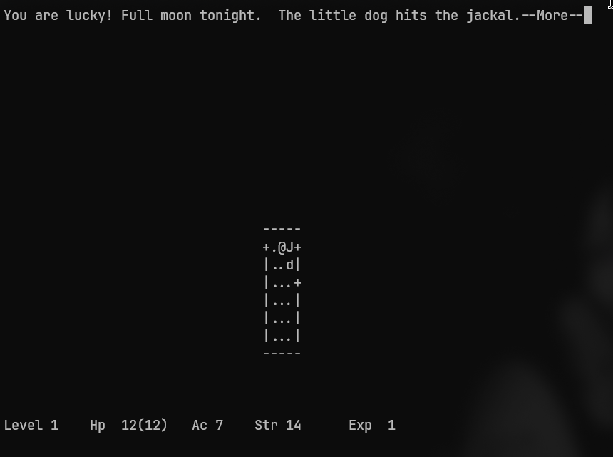
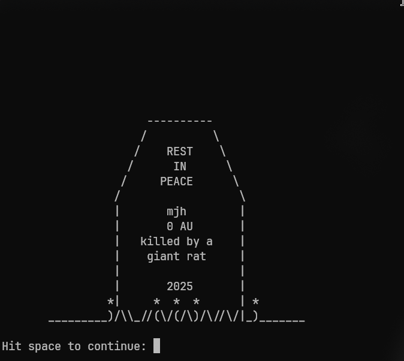

# restoHack: Bringing 1984 Hack Back from the Dead

**restoHack** is a full-blooded resurrection of *Hack*, the 1984 roguelike that spawned *NetHack*.
Not a remake. Not a reboot. This is *software preservation with a blowtorch and a scalpel*.

The goal: make the original code compile, run, and dungeon-crawl exactly as it did when floppy was King.

Think resto-mod: the soul stays vintage, the internals get a precision rebuild.

---

<h3 align="Left">Screenshots</h3>
<p align="center"><em>Luck and death, in that order.</em></p>

<p align="center">
  <a href="https://github.com/Critlist/restoHack/releases">
    
  </a>
  <a href="https://github.com/Critlist/restoHack/releases">
    
  </a>
</p>

---

## Features

* **Modern Build System** – CMake replaces Makefiles. Clean builds on Linux, FreeBSD, and other Unix systems.
* **Authentic Systems** – Over a dozen original systems restored from source, untouched in design.
* **Complete K\&R Modernization** – Entire codebase converted to ANSI C (\~250 functions updated).
* **Unix/Linux Fixes** – No more hardcoded BSD paths or FS quirks.
* **Cross-Platform Verified** – Works on Linux (glibc/musl) & FreeBSD; CI-tested.
* **Tiny Executable** – 479KB of pure roguelike, with save/load intact.

> **Tested on:** Arch, Alpine, FreeBSD 14.2.
> macOS support pending. Arch users can install via the AUR.

---

## Installation

### Arch Linux (AUR)

```bash
yay -S restohack
```

### Hybrid Binary+Source Tarball

Download from [Releases](https://github.com/Critlist/restoHack/releases) and extract:

```bash
mkdir -p ~/Games/restohack
cd ~/Games/restohack
tar -xzf restoHack-static-YYYYMMDD-linux-x86_64.tar.gz
```

**Option 1: Run immediately  (Linux)** (static binary, no dependencies):

```bash
./run-hack.sh
```

**Option 2: Build from included source** (requires cmake, gcc, ncurses):

```bash
cmake -S . -B build -DCMAKE_BUILD_TYPE=Release
cmake --build build
./build/hack
```

**BSD Systems:** See [BSD Build Instructions](#bsd-build-instructions) below.

---

## Building from Source

**Requirements:** `git`, `cmake`, a C compiler (`gcc` or `clang`), plus `ncurses` or `termcap`.

### Standard Source Build (Release)

The default method for a stable, optimized build:

```bash
git clone https://github.com/Critlist/restoHack.git
cd restoHack
mkdir build && cd build
cmake .. -DCMAKE_BUILD_TYPE=Release
cmake --build .
./hack
```

### Development Build (Debug)

For hacking on the code, with debug symbols and optional sanitizers:

```bash
git clone https://github.com/Critlist/restoHack.git
cd restoHack
mkdir build && cd build
cmake .. -DCMAKE_BUILD_TYPE=Debug -DENABLE_SANITIZERS=ON
cmake --build .
./hack
```

### Clean Rebuild

Wipes prior build artifacts before rebuilding:

```bash
rm -rf build && mkdir build && cd build
cmake .. -DCMAKE_BUILD_TYPE=Release
cmake --build .
./hack
```

### BSD Build Instructions

**FreeBSD:**

```bash
# Install dependencies
pkg install cmake gcc ncurses

# Build from hybrid tarball or git clone
cmake -S . -B build -DCMAKE_BUILD_TYPE=Release
cmake --build build
./build/hack
```

**OpenBSD:**

```bash
# Install dependencies  
pkg_add cmake gcc ncurses

# Build with explicit compiler paths
cmake -S . -B build -DCMAKE_BUILD_TYPE=Release \
  -DCMAKE_C_COMPILER=/usr/local/bin/gcc
cmake --build build
./build/hack
```

**NetBSD:**

```bash
# Install dependencies
pkgin install cmake gcc ncurses

# Use pkgsrc paths for libraries
cmake -S . -B build -DCMAKE_BUILD_TYPE=Release \
  -DCMAKE_PREFIX_PATH=/usr/pkg
cmake --build build  
./build/hack
```

---

## Work in Progress

**Current Development: v1.1 - Hardening and Safety**

The current work-in-progress focuses on introducing comprehensive hardening and safety parameters that the original 1984 code lacked. This version emphasizes stability improvements including:

* Enhanced memory safety and bounds checking
* Improved error handling and recovery mechanisms  
* Compiler warning elimination and code hardening
* Environment-specific adaptations for varying systems
* Robust input validation and sanitization
* Address compiler warnings

⚠️ **RELAX, MAN, IT COMPILES!.**  
This was the guiding philosophy of 1984. The original *Hack* was held together with duct tape, raw `struct` dumps, and mullet grease.  
Stability was a suggestion, not a guarantee.  

Version **1.1** looks to fix that: modern hardening, memory safety, and input validation — while keeping the authentic 1984 gameplay intact.

---

## Recent Fixes

* **Modern Locking** – Replaced `link()` locks with `flock()` for clean recovery.
* **NetBSD/pkgsrc Builds** – Fixed curses detection and RNG seeding via CMake feature checks.
* **Tombstone Crash** – Fixed segfault in RIP screen by patching buffer overflow in name centering.
* **Memory Safety and Hardening** - Addressed memory issues, Compiler warnings, and Hardened for varying enviroments.

---

## Preservation Philosophy

Fix what breaks, preserve what works. The original 1984 gameplay, balance, and feel remain untouched—only the infrastructure has been made reliable for modern systems.

---

## Gameplay

You’re the `@`, diving into the Mazes of Menace to steal the Amulet of Yendor.
Expect monsters, magic, cursed loot, and permadeath. Controls are Vi-style (`hjkl`). Survival is… unlikely.

---

## Contributing

Bug fixes, portability patches, packaging help—welcome.
Want to port to Plan 9? Go for it. Just document changes and respect the code.

---

## License

3-Clause BSD. Do what you want, just don’t sue us. See `LICENSE`.
